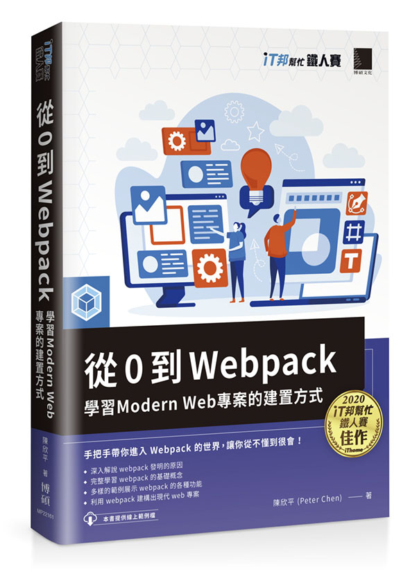

# 從 0 到 Webpack 的範例程式

此庫為**從 0 到 Webpack** 一書的範例程式碼。

**從 0 到 Webpack** 是本介紹 webpack 的專書。

## 書籍連結

* [天瓏書局](https://www.tenlong.com.tw/products/9789864348626)
* [博客來](https://www.books.com.tw/products/0010901554)

## v5 範例目錄

### [第一章：寫在 webpack 之前](./v5/ch01-before-webpack)

* [JavaScript 的模組化之路](./v5/ch01-before-webpack/02-history-of-js-module)
* [新技術的崛起](./v5/ch01-before-webpack/03-new-tech)
* [提升網頁效能](./v5/ch01-before-webpack/04-performance)
* [各類工具的出現](./v5/ch01-before-webpack/05-tools)

### [第二章：認識 webpack](./v5/ch02-getting-started)

* [第一個 webpack 應用程式](./v5/ch02-getting-started/02-first-webpack)
* [安裝 webpack](./v5/ch02-getting-started/03-install-webpack)
* [使用 webpack](./v5/ch02-getting-started/04-use-webpack)
* [使用 Loaders](./v5/ch02-getting-started/05-use-loaders)
* [使用 Plugins](./v5/ch02-getting-started/06-use-plugins)
* [使用 DevServer](./v5/ch02-getting-started/07-use-dev-server)

### [第三章：配置 webpack](./v5/ch03-configuration)

* [配置物件](./v5/ch03-configuration/01-configuration-object)
* [入口 Entry](./v5/ch03-configuration/02-entry)
* [輸出 Output](./v5/ch03-configuration/03-output)
* [解析 Resolve](./v5/ch03-configuration/04-resolve)
* [模組 Module 的規則判定](./v5/ch03-configuration/05-module)
* [模組 Module 的處理](./v5/ch03-configuration/06-module-use)
* [插件 Plugins](./v5/ch03-configuration/07-plugins)
* [監聽 Watch](./v5/ch03-configuration/08-watch)
* [Source Map](./v5/ch03-configuration/09-source-map)
* [Dev Tool](./v5/ch03-configuration/10-devtool)
* [最佳化 Optimization 與模式 Mode](./v5/ch03-configuration/11-optimization)
* [配置檔的種類](./v5/ch03-configuration/12-configuration-types)
* [使用 Node.js API 操作 webpack](./v5/ch03-configuration/13-use-node-api)

### [第四章：真實世界的 webpack](./v5/ch04-real-world)

* [使用 JavaScript](./v5/ch04-real-world/01-javascript)
* [使用 Style](./v5/ch04-real-world/02-style)
* [使用 Image](./v5/ch04-real-world/03-image)
* [配置多模式專案](./v5/ch04-real-world/04-config-setup)
* [Module Federation](./v5/ch04-real-world/05-module-federation)

### [第五章：使用 webpack 優化環境體驗](./v5/ch05-optimization)

* [建立 webpack 開發環境](./v5/ch05-optimization/01-development)
* [建立 webpack 生產環境 - 減小體積](./v5/ch05-optimization/02-production-minimize)
* [建立 webpack 生產環境 - 切割代碼](./v5/ch05-optimization/03-production-code-splitting)
* [建立 webpack 生產環境 - 快取](./v5/ch05-optimization/04-production-caching)
* [建立 webpack 生產環境 - 追蹤建置](./v5/ch05-optimization/05-production-analyze)

### [第六章：解構 webpack](./v5/ch06-inside)

* [Bundle 導讀](./v5/ch06-inside/01-read-bundle)
* [自己動手寫 webpack](./v5/ch06-inside/02-write-your-webpack)
* [Loader 的內部構造](./v5/ch06-inside/03-inside-loader)
* [Plugin 的內部構造](./v5/ch06-inside/04-inside-plugin)

### [第七章：寫在 webpack 之後](./v5/ch07-after-webpack)

* [使用 Snowpack 以原生模組系統建置專案](./v5/ch07-after-webpack/01-snowpack)
