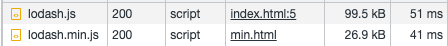

# min

## index.html

```html
<!-- ch01-before-webpack/04-performance/min/index.html -->
<!DOCTYPE html>
<html>
  <head>
    <script src="https://unpkg.com/lodash@4.17.21/lodash.js"></script>
  </head>
  <body>
    <!-- ... -->
  </body>
</html>
```

引入未做壓縮的 Lodash 。

## min.html

```html
<!-- ch01-before-webpack/04-performance/min/min.html -->
<!DOCTYPE html>
<html>
  <head>
    <script src="https://unpkg.com/lodash@4.17.21/lodash.min.js"></script>
  </head>
  <body>
    <!-- ... -->
  </body>
</html>
```

引入壓縮後的 Lodash 。

## 結果



壓縮後的資源會比原本的請求 Size 小，所需的時間也會比較少。
