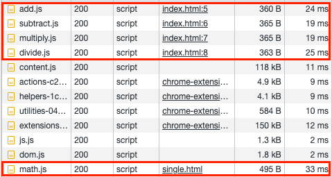

# multiple-import

## add.js

```js
function add(a, b) {
  return a + b;
}
```

## subtract.js

```js
function subtract(a, b) {
  return a - b;
}
```

## multiple.js

```js
function multiply(a, b) {
  return a * b;
}
```

## divide.js

```js
function divide(a, b) {
  return a / b;
}
```

## index.html

```html
<!-- ch01-before-webpack/04-performance/multiple-import/index.html -->
<!DOCTYPE html>
<html>
  <head>
    <script src="add.js"></script>
    <script src="subtract.js"></script>
    <script src="multiply.js"></script>
    <script src="divide.js"></script>
  </head>
  <body>
    <!-- ... -->
  </body>
</html>
```

引入 `add.js` 、 `subtract.js` 、 `multiply.js` 與 `divide.js` 四個檔案，來取得 `add()` 、 `subtract()` 、 `multiply()` 與 `divide()` 四個函式功能。

## math.js

```js
function add(a, b) {
  return a + b;
}

function subtract(a, b) {
  return a - b;
}

function multiply(a, b) {
  return a * b;
}

function divide(a, b) {
  return a / b;
}
```

合併 `add.js` 、 `subtract.js` 、 `multiply.js` 與 `divide.js` 四個檔案的內容。

## single.html

```html
<!-- ch01-before-webpack/04-performance/multiple-import/single.html -->
<!DOCTYPE html>
<html>
  <head>
    <script src="math.js"></script>
  </head>
  <body>
    <!-- ... -->
  </body>
</html>
```

引入單個 `math.js` 來取得 `add()` 、 `subtract()` 、 `multiply()` 與 `divide()` 四個函式功能。

## 結果



`index.html` 引入各個模組獨立的檔案，雖然每個檔案所需的容量或時間較少，但加起來會較引入單個檔案的 `single.html` 多。
