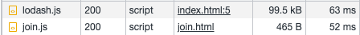

# partial-use

## index.html

```html
<!-- ch01-before-webpack/04-performance/partial-use/index.html -->
<!DOCTYPE html>
<html>
  <head>
    <script src="https://unpkg.com/lodash@4.17.21/lodash.js"></script>
  </head>
  <body>
    <h1>All</h1>
    <a href="./join.html">Go to Only join</a>
    <script>
      console.log(_.join(['For', 'all'], ' '));
    </script>
  </body>
</html>
```

為了使用 `_.join()` 而引入了完整的 Lodash 庫。

## join.html

```html
<!-- ch01-before-webpack/04-performance/partial-use/join.html -->
<!DOCTYPE html>
<html>
  <head>
    <!-- ... -->
    <script src="https://unpkg.com/lodash@4.17.21/join.js"></script>
  </head>
  <body>
    <h1>Only join</h1>
    <a href="./index.html">Go to All</a>
    <script>
      console.log(join(['Only', 'join'], ' '));
    </script>
  </body>
</html>
```

從 Lodash 庫中引入單獨的 `join()` 。

## 結果



引入完整的庫所需的容量與時間都比只引入所需來得多。
