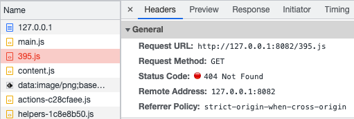

# output-publicpath

## src/hello.js

```js
export default 'Hello';
```

## src/index.js

```js
async function getString() {
  const { default: hello } = await import('./hello.js');

  return hello;
}

getString().then((str) => {
  console.log(str);
});
```

延遲載入 `src/hello.js` ，並使用它。

## webpack.config.error.js

```js
const path = require('path');

module.exports = {
  output: {
    path: path.resolve(__dirname, 'build/js'),
    publicPath: '',
  },
};
```

輸出目錄設為 `build/js` ，而 `publicPath` 則空值。

### webpack.config.error.js 建置結果

```bash
asset main.js 1.99 KiB [emitted] [minimized] (name: main)
asset 395.js 132 bytes [emitted] [minimized]
runtime modules 5.53 KiB 8 modules
cacheable modules 308 bytes
  ./src/index.js 221 bytes [built] [code generated]
  ./src/hello.js 87 bytes [built] [code generated]
```

實際啟動伺服器（ `npm start` ），會發現 `404 Not Found` 的錯誤。



這是因為 `publicPath` 設置錯誤。

## webpack.config.js

```js
const path = require('path');

module.exports = {
  output: {
    path: path.resolve(__dirname, 'build/js'),
    publicPath: '/js/',
  },
};
```

設定 `publicPath` 為 `/js` ，符合於伺服器上的位置，解決問題。

## webpack.config.auto.js

```js
const path = require('path');

module.exports = {
  output: {
    path: path.resolve(__dirname, 'build/js'),
    publicPath: 'auto',
  },
};
```

設定 `publicPath` 為 `auto` 或是不要設定（採用預設值）， webpack 會幫忙自動配置正確的路徑，如果在伺服器上不會自己改變檔案的相對位置的話，使用自動配置即可。
