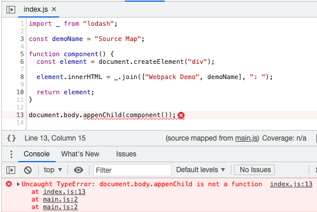

# source-map

## src/index.js

```js
import _ from 'lodash';

const demoName = 'Without Source Map';

function component() {
  const element = document.createElement('div');

  element.innerHTML = _.join(['Webpack Demo', demoName], ': ');

  return element;
}

document.body.appenChild(component());
```

最後一行的 `appenChild()` 會出錯，應為 `appendChild()` 。

## package.json

```json
{
  "scripts": {
    "dev": "http-server ./dist & webpack --mode production --watch --devtool source-map"
  }
  // ...
}
```

設定 `--devtool` 為 `source-map` 來開啟 source map 功能。

## 結果

```palintext
dist
|- main.js
|- main.js.map
```

會產生 `main.js.map` 的 source map 檔案。



由於設置要產出 source map ，因此 webpack 會產生 source map 內容存於 `dist/main.js.map` 中，在執行出錯時，會使用 source map 由 bundle 的位置轉至來源的代碼位置。
