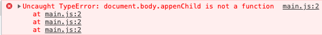
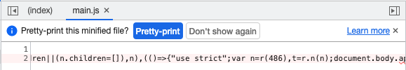

# without-source-map

## src/index.js

```js
import _ from 'lodash';

const demoName = 'Without Source Map';

function component() {
  const element = document.createElement('div');

  element.innerHTML = _.join(['Webpack Demo', demoName], ': ');

  return element;
}

document.body.appenChild(component());
```

最後一行的 `appenChild()` 會出錯，應為 `appendChild()` 。

## 結果





由於沒有 source map ，因此在執行後出錯所顯示的位置會是 bundle 內的代碼位置，並不會對應至原始碼的檔案位置。
